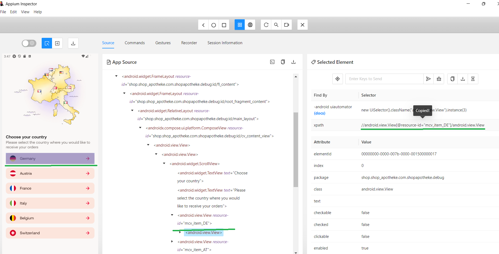

##Pre-requiste:
Java,maven and an IDE(used eclipse) are installed

##Quick Start - Appium set up on Windows (Android):

1) Install [NodeJS](https://nodejs.org/en/download/package-manager). 

2) Install [ANDROID STUDIO](https://developer.android.com/studio) application.

3) Install Appium Server using npm (CLI) command npm install -g appium. Appium server version 2.12.1
Command to check the installed appium version: `appium --version`

4) Add below Android SDK path in the environment variable

    - ANDROID_HOME = <path to Sdk folder>
    - %ANDROID_HOME%\build-tools
    - %ANDROID_HOME%\platform-tools

5) Install [Appium Inspector](https://github.com/appium/appium-inspector/releases/tag/v2024.12.1) or use [link](https://inspector.appiumpro.com/)

📌 Appium Doctor to verify the installations

1) Install appium-doctor using command npm install -g appium-doctor

2) To view the list of available options appium-doctor --help

To check Android set up `appium-doctor --android`

📌 Creating Android Virtual Device (Emulator) from Android Studio:

1) Open Android Studio.

2) Click on Tools -> AVD Manager -> Create Virtual Device -> Select the device and OS version -> Finish.

3) Once Virtual device is created, click on Launch this AVD in the emulator.

4) Command to view the list of devices attached `adb devices`.

5) Command to  start device from CLI `emulator -avd <avd_name>`

6) Install the app using the apk by running `adb install <file.apk>` (Wanted to reduce the setup and execution time as my machine was slow)

📌 Android - Finding appPackage and appActivity:

Since the app is already installed on virtual device  we can make use of appPackage and appActivity to launch the app

1) Open the app on the device, for which appPackage and appActivity is required.

Open powershell and entered command adb shell dumpsys window | grep -E 'mCurrentFocus|mFocusedApp' which helps to identify appPackage and appActivity

## Inspecting Elements

- Appium inspector for locating and inspecting elements.

- Appium inspector launch page

- Appium inspector inspecting element

## To run the test

1) Ensure the app is installed on the virtual device.

2) Virtual device is up and running

3) Appium server is running

4) Checkout/clone the project and build the maven dependencies 

5) Right click on Testng.xml file and run as TestNG Suite or run mvn test/mvn clean test (the application turn up time varies and at times translation does not happen properly, hence try more than once in case of failure)